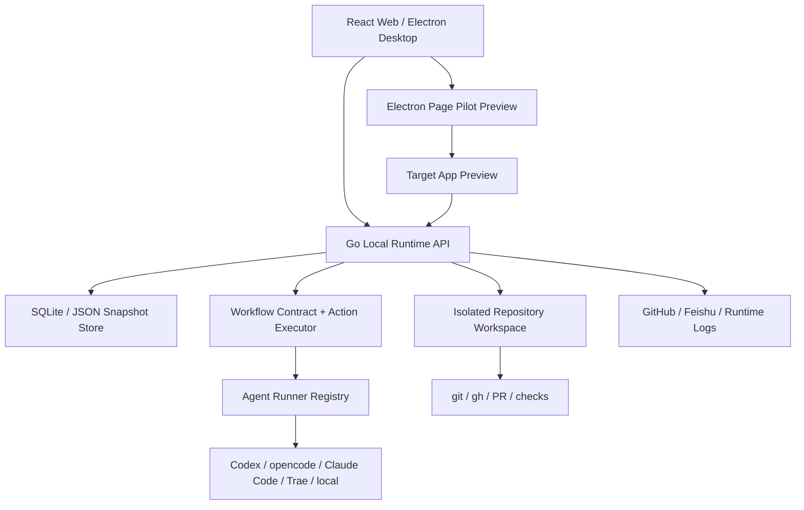

# Omega 最新架构文档

更新时间：2026-05-02

## 目标

Omega 当前架构围绕两个核心能力建设：

1. 功能一：从 Work Item 到隔离 Repository Workspace、Agent 执行、PR、Review、Human Gate、Merge、Proof 的真实闭环。
2. 功能二：Page Pilot 在目标页面内圈选真实 DOM，收集上下文，驱动 Agent 修改目标仓库并热更新预览。

系统原则：

- Work Item / Agent 执行必须锁定明确 Repository Workspace。
- 代码修改、PR、diff、proof、Page Pilot 热更新都使用真实数据和真实命令，不做假 UI。
- Workflow / Agent / Prompt 逐步配置化，但所有 action 必须有 runtime handler，不能只停留在展示层。

## 总体分层



## 前端与桌面层

- `apps/web` 是 React SPA，负责 Workboard、Work Item 详情、Workspace 设置、Page Pilot 入口、Observability 和 Runner/Profile 配置。
- Electron Desktop 直接承载同一 Web UI，并负责启动或连接：
  - Go local runtime
  - Web Vite dev server 或生产静态资源
  - Page Pilot 目标项目 preview runtime
- Page Pilot 保留目标页内旧版操作体验：浮层、圈选、对话、Confirm / Discard、热更新；Omega Web 只负责选择 Repository Workspace 和打开目标 preview。

## Go Local Runtime

Go runtime 是本地控制面和执行面，主要职责：

- 管理 Work Item、Requirement、Pipeline、Attempt、Operation、Proof、Checkpoint、Runtime Logs。
- 绑定 Repository Target，创建隔离 workspace，防止误写 Omega 自身或用户正在开发的目录。
- 读取 workflow contract，生成 Pipeline snapshot 和 Attempt action plan。
- 调用 Agent runner，记录 heartbeat、stdout/stderr、exit code、runner telemetry。
- 执行 git / gh / checks / merge / PR description 更新。
- 生成 Run Workpad、review packet、run report、handoff bundle。

## 数据存储

当前采用本地 SQLite 为主，兼容旧 JSON snapshot：

- 一等表：Agent Profile、Repository Target、Runtime Log、Checkpoint、Attempt 等核心记录已逐步 SQLite 化。
- Pipeline run 中保存 workflow snapshot，避免后续模板变化影响正在执行的 Attempt。
- Run Workpad 聚合 Plan、Acceptance Criteria、Validation、Notes、Blockers、PR、Review Feedback、Retry Reason，详情页优先消费它。

后续技术债：

- 继续清理旧 JSON 兼容代码。
- 把 repository-first 存储模型彻底一等化。

## DevFlow Workflow Contract

默认 contract 文件：

```text
services/local-runtime/workflows/devflow-pr.md
```

覆盖优先级：

1. 目标仓库 `.omega/WORKFLOW.md`
2. Workspace / Repository Agent Profile workflow markdown
3. 默认 `devflow-pr`

当前默认阶段：

1. `todo`
2. `in_progress`
3. `code_review_round_1`
4. `code_review_round_2`
5. `rework`
6. `human_review`
7. `merging`
8. `done`

## Action Executor

`states.actions` 已成为真实运行协议。runtime 会校验 action type，并按 contract action 顺序调用真实 handler。

已落地 handler：

- `write_requirement_artifact`
- `classify_task`
- `run_agent`
- `run_validation`
- `ensure_pr`
- `run_review`
- `build_rework_checklist`
- `human_gate`
- `refresh_pr_status`
- `merge_pr`
- `write_handoff`

当前真实执行覆盖：

- `todo`：写 Requirement artifact。
- `in_progress`：任务分类、架构、编码、验证、创建 / 更新 PR。
- Review：从 `run_review` action 派生 review round，按 verdict 路由。
- Rework：构建 checklist、执行返工、验证、更新 PR。
- Human Review：approve 只记录人工决策，request changes 进入 rework assessment。
- Merging：刷新 PR 状态并执行真实 merge。
- Done：更新 handoff bundle / proof。

保留边界：

- 部分 handler 代码仍在 `devflow_cycle.go` / `server.go` 中，下一步会拆成独立 handler 文件。
- Fast human-requested rework continuation 仍复用 DevFlow adapter 的上下文组装，但执行语义已和 Rework / Review contract 对齐。

## Agent Runner

Runner registry 当前支持：

- Codex：默认优先，本机登录 / CLI 环境使用。
- opencode：可通过页面配置账号 key，运行时解密注入环境变量。
- Trae：已做 runner 适配；页面支持 EP ID / API Key 账号配置，运行时只注入临时环境变量。
- Claude Code：本机 CLI 配置方式保留，不走页面 key 管理。
- local runner：用于本地验证、proof、非 LLM action。

敏感配置原则：

- UI 可录入 key，但持久化必须加密。
- 页面默认 masked 展示，支持显示 / 隐藏开关。
- 执行时临时解密并注入 runner 环境变量，不在普通 API 响应中返回明文。

## GitHub / CI / 出站同步

已落地：

- 运行前 GitHub delivery preflight。
- PR 创建 / 更新、checks 读取、PR comments / reviews 基础采集。
- failed check log 基础采集进入 Rework Checklist。
- merge conflict / branch sync / required checks 作为 delivery signal。
- issue comment / label / PR review packet 出站同步。

后续增强：

- GitHub polling supervisor。
- 更细的 CI flaky / permission / temporary network 分类恢复。
- 多端协作和 shared sync。

## Human Review 与飞书

Human Review 是一等 checkpoint：

- Omega Web 本地 approve / request changes 与飞书审核同步同级。
- 飞书消息可发送审核卡片或 Task。
- Task 完成表示 approve；未完成但回复内容可被同步为 request changes。
- 多任务通过 checkpoint / pipeline / work item 绑定，避免只靠关键词匹配。

## Page Pilot

Page Pilot 当前职责：

- 从 Omega Web 选择 Repository Workspace。
- 由 Preview Runtime Agent 启动或连接目标项目 preview。
- Electron 内打开目标页面并注入浮层。
- 用户圈选真实 DOM，提交 selector、DOM context、style snapshot、source context 和指令。
- Page Pilot Agent 修改目标 repo，触发热更新。
- 用户 Confirm 后交付，Discard 则丢弃本轮修改。

安全方向：

- 后续引入 isolated-devflow mode：先在隔离 workspace 修改，确认后再回写目标仓库。

## 可观测性

已落地：

- Runtime log：支持实体维度、全文搜索、cursor pagination、导出。
- Observability dashboard：时间窗口、分组统计、趋势、最近失败、慢阶段 drilldown。
- Attempt timeline：聚合 attempt event、pipeline event、stage snapshot、operation、proof、checkpoint、runtime log。
- Run Workpad：面向用户展示当前计划、反馈、风险、重试原因。

## 当前验证

常用命令：

```bash
npm run lint
npm run test -- apps/web/src/core/__tests__/manualWorkItem.test.ts apps/web/src/__tests__/App.operatorView.test.tsx --testTimeout=15000
npm run build
go test ./services/local-runtime/internal/omegalocal
```

本次架构更新验证：

```bash
go test ./services/local-runtime/internal/omegalocal
```

